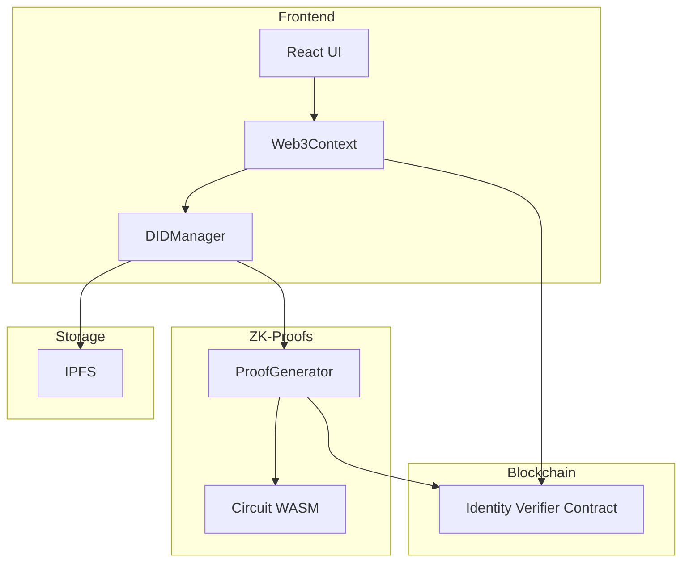

# Privacy-Preserving Decentralized Identity Verification System

## Description

A prototype decentralized identity verification system that leverages zero-knowledge proofs to verify user attributes (age, income, residency) without revealing the actual data. The system enables users to demonstrate specific attributes while maintaining privacy of their sensitive information. Built with Ethereum smart contracts, ZK-SNARKs, and React.

### Why This Project?

Traditional identity verification systems often require users to expose sensitive personal information. This project enables privacy-preserving verification where users can prove they meet certain criteria without revealing their actual data. By using ZK-SNARKs technology, we can ensure that verification happens without compromising user privacy.

## Table of Contents

- [Features](#features)
- [Architecture](#architecture)
- [Prerequisites](#prerequisites)
- [Installation](#installation)
- [Usage](#usage)
- [Technical Details](#technical-details)
- [Testing](#testing)
- [Documentation](#documentation)

## Features

- 🔐 Zero-knowledge proofs for private attribute verification
- 🌐 Decentralized identity management with DID creation
- ⛓️ Ethereum smart contract integration for proof verification
- 🔍 Multi-attribute verification (age, income, residency)
- 📱 React-based user interface for proof generation and verification
- 🔒 MetaMask wallet integration
- 📂 Off-chain storage for verifiable credentials
- ✅ Comprehensive test suite for system validation

## Architecture



## Prerequisites

- Node.js >= 16.0.0
- MetaMask wallet
- Git
- Local blockchain environment (Hardhat)
- Circom (for ZK-SNARK circuit compilation)

## Installation

1. Clone the repository:

```bash
git clone https://github.com/yourusername/privacy-preserving-id-system.git
cd privacy-preserving-id-system
```

2. Install dependencies:

```bash
npm install
```

3. Set up environment variables:

```bash
cp .env.example .env
```

Edit .env with your configuration:

```
REACT_APP_CONTRACT_ADDRESS=your_contract_address
REACT_APP_IPFS_NODE=http://localhost:5001
REACT_APP_PROVIDER_URL=http://localhost:8545
```

4. Compile the circuits:

```bash
npm run compile:circuits
npm run setup:circuits
npm run phase2:circuits
npm run contribute:key
npm run export:key
```

5. Deploy the smart contract:

```bash
npx hardhat run scripts/deploy.ts --network localhost
```

## Usage

1. Start the development server:

```bash
npm start
```

2. Connect your MetaMask wallet to the application

3. Create a DID with your credentials:

```typescript
const credentials = {
  age: 25,
  income: 50000,
  residency: "NY",
};
```

4. Generate and submit proofs for verification:

```typescript
const conditions = {
  ageThreshold: 18,
  incomeThreshold: 30000,
  expectedResidency: "NY",
};
```

## Technical Details

### Core Dependencies

- React: ^18.2.0
- Ethers.js: ^6.0.0
- Hardhat: ^2.19.4
- Circom: ^2.1.6
- SnarkJS: ^0.7.2
- Web3.js: ^4.16.0
- TailwindCSS: ^3.4.17

### Smart Contracts

- Solidity: ^0.8.20
- OpenZeppelin Contracts: ^5.0.1

### Development Tools

- TypeScript: ^5.3.3
- Webpack: ^5.89.0
- PostCSS: ^8.4.31

## Testing

The system includes comprehensive test cases demonstrating:

- DID creation and management
- Proof generation for single and multiple attributes
- Smart contract verification
- End-to-end system functionality

To run tests:

```bash
npm test
```

## Documentation

Detailed documentation is available covering:

- System architecture and components
- ZK-SNARK proof generation process
- Smart contract functionality
- API documentation
- Setup and deployment instructions

## Security Considerations

- All proofs are verified on-chain
- Private data never leaves the user's device
- Zero-knowledge proofs ensure data privacy
- Smart contract audited for security vulnerabilities
- Regular security updates and patches

## Contributing

Contributions are welcome! Please read our contributing guidelines before submitting pull requests.

## License

This project is licensed under the MIT License - see the LICENSE file for details.
